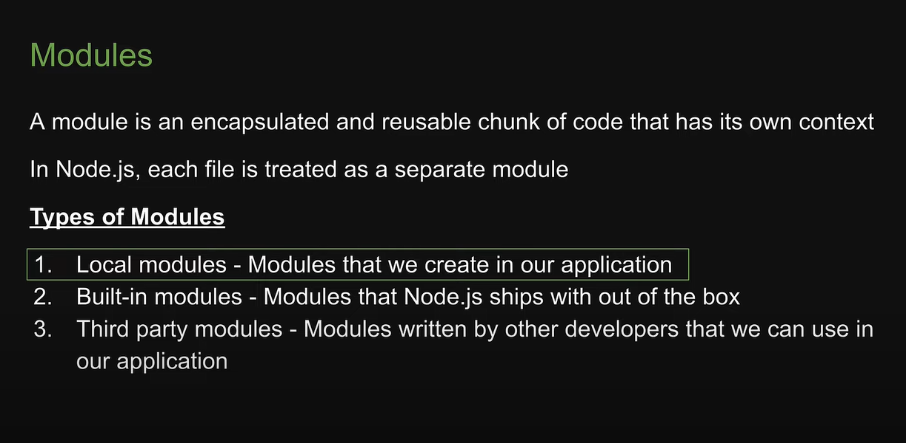

# Node js course

## Introduction

- Node js is an open source, cross-platform Javascript runtime environment

- Why Node js
  
- 13

- Core concepts
  

## ECMAScript

## Chrome V8 Engine

## Javascript runtime

- What can we build with nodeJs
  
  
  

## Browser vs Node.js

## Modules

## Module Wrapper Contd;

## Module caching 
