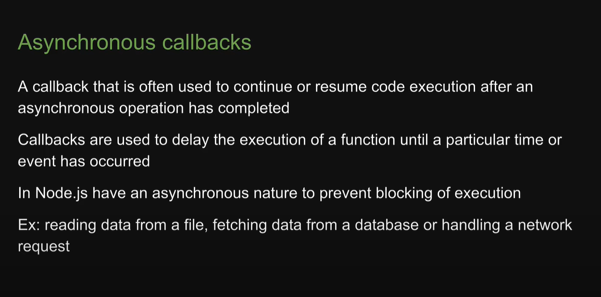
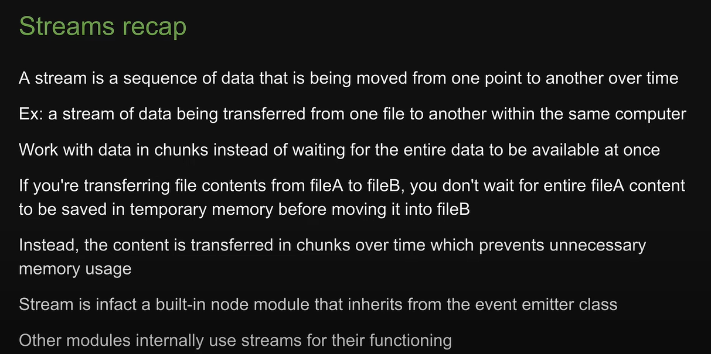
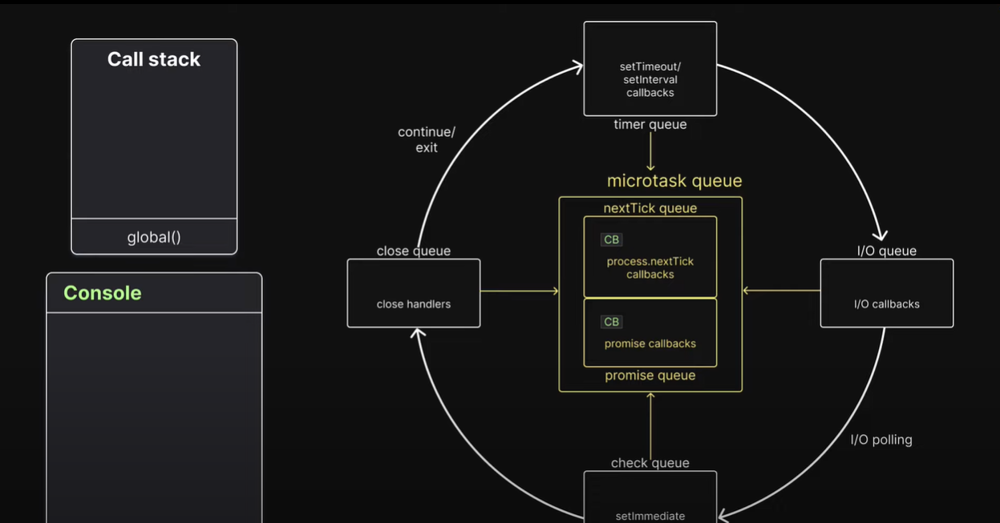
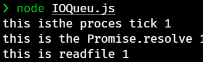

# Node js course

## Introduction

- Node js is an open source, cross-platform Javascript runtime environment

- Why Node js
  
- 13

- Core concepts
  

## ECMAScript

## Chrome V8 Engine

## Javascript runtime

- What can we build with nodeJs
  
  
  

## Browser vs Node.js

## Modules

## Module Wrapper Contd;

## Module caching

## CommonJS

## ES Modules

## node:Protocol

## Asynchronous callbacks

## Events Module

## Detour

### Character sets

### Encoding

### Streams and buffers

### Asynchronous Javascript

### fs module

### Stream recap

### Pipes

### HTTP Module so far

### Web Framework

### Section summary

### libuv

### Thread pool

## Network IO

## Event Loop

## Microtask Queue

- Task is this :
  
  
  
  
  
  
  

- Second TAsk is this :
  
  
  
  
  

- third task
  

  - My assumption
    
  - Answer
    

    - yep i made a mistake

  - Eplanation
    
    
    
    
    
    
    
    
    
    
    

## Timer Queue

- question statement
  
  - answer
    
  - I think no need for explanation , coz event loop always firs check the misrotask queue before going to the other queues, it should empty the microtask queue first always
  - one thing to mention is after ever callback inside of timer queue event loop again checks the microtask queue

## IO queue

- Answer
  
  

## IO polling

## chech queue

## Close Queue

## Event loop summary

## npm

## Versioning

## npm scripts

## CLI

## Cluster Module

## Worker Thread

